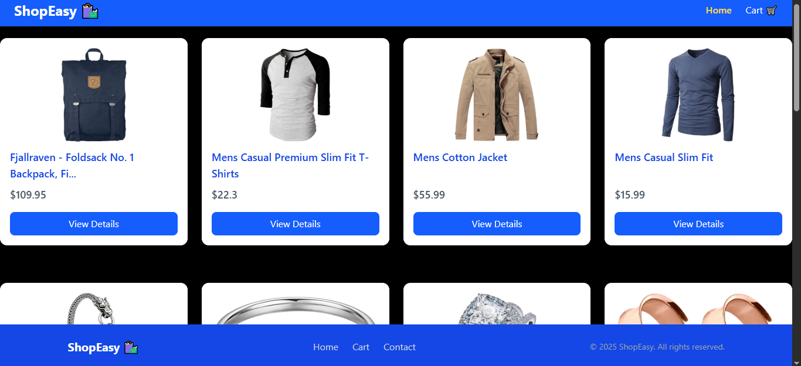
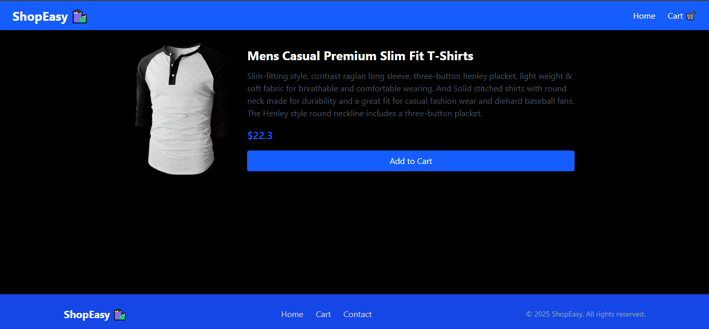

# Shopeasy - React E-commerce Website

*Shopeasy uses fake storage API and fetch the products . we can add or remove the product from cart *

## 🚀 Features

- **fake storage API** 
- **Add to cart** and **remove from cart**
- Responsive design

## 🛠️ Tech Stack

- React,React-router-DOM,Tailwind CSS , axios 

## ⚙️ Installation

 ** Clone the repository  **

   ```bash
  https://github.com/Dudekula-Safina-Begum/shopeasy.git


  cd shopeasy
  npm install
  npm run dev   
  
  ```

## 📸 Screenshots
  



## 🌐 Live Demo
[Visit Shopeasy]( https://dudekula-safina-begum.github.io/shopeasy/)

## 📁 Folder Structure

``` bash

shopeasy/
 ├── src/
    ├── components
           ├ Navbar.jsx
           ├ Footer.jsx
           └ ProductCard.jsx
    ├── context
           ├ CartContext.jsx
           └ ProductContext.jsx
    ├── pages
           ├ Home.jsx
           ├ Cart.jsx
           ├ Contact.jsx
           ├ ProductDetails.jsx
           └ NotFound.jsx
    ├─── App.jsx

```

           
     
## 👩‍💻 Author
**Safina Begum**  
- 🌍 [GitHub](https://github.com/Dudekula-Safina-Begum)  
- 💼 Frontend Developer | Passionate about creative web design
 

